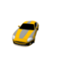

# Neural Scene Representation Network

Implementation and Colab Notebook will soon be uploaded. 

### Change in model's view rendering over training steps

<table><tbody>
<!-- START TABLE -->
<!-- TABLE HEADER -->
<th valign="bottom">Model Output</th>
<th valign="bottom">Ground Truth View</th>
<!-- TABLE BODY -->
</tbody></table>

### Normal Map 
<table><tbody>
<!-- START TABLE -->
<!-- TABLE HEADER -->
<th valign="bottom">Normal Map</th>
<th valign="bottom">Image</th>
<!-- TABLE BODY -->
<tr>
<td></td>
<td></td>
</tr>
</tbody></table>

### 360 View Rendering
Scene Representation Networks are capable of rendering novel views unseen during training. 

  
Since Scene Representation Networks take as input 3D Cartesian coordinates and output latent representations at those
spatial points, the networks can render views at arbitrary resolutions just by  sampling at a finer grain. 

Although the model itself was trained using 64 by 64 images, we can render higher resolution outputs.
<table><tbody>
<!-- START TABLE -->
<!-- TABLE HEADER -->
<th valign="bottom">64 x 64</th>
<th valign="bottom">128 x 128</th>
<th valign="bottom">256 x 256</th>
<!-- TABLE BODY -->
<tr>
<td></td>
<td></td>
<td></td>
</tr>
</tbody></table>

<!--

-->
## References

[1] Sitzmann, Vincent, Michael Zollhöfer, and Gordon Wetzstein. "Scene representation networks: Continuous 3d-structure-aware neural scene representations." arXiv preprint arXiv:1906.01618 (2019).
